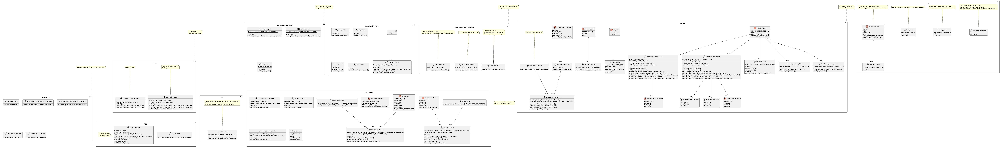

# MACKI mainboard

Software for the MACKI mainboard

## Installation

- Target: ESP32-S3 MCU
- ESP-IDF version: **release/v5.2**
- Install the ESP-IDF following the instructions on the [official documentation](https://docs.espressif.com/projects/esp-idf/en/v5.2.2/esp32/get-started/index.html)

```bash
cd $IDF_PATH
git fetch
git checkout vX.Y.Z
git submodule update --init --recursive
```

## Build

- Clone the repository
- Run `idf.py build` in the project directory `src` in ESP-IDF environment

## Docker

- Build the docker image with `docker build -t macki .`
- Run the docker container with `docker run -it --rm -v $(pwd):/macki macki`

VS code can also be opened in the container

## Architecture



## Hardware

TBD